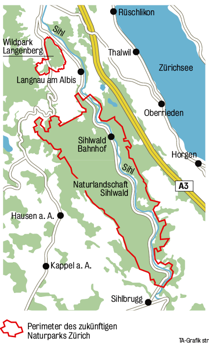

# Dead Tree Detection

This project is a hands-on notebook for detecting dead trees from high-resolution RGB aerial imagery of the Sihlwald forest.

Students will load aerial images, run a pretrained YOLO model, compare inference strategies, implement simple post-processing, analyse dead tree detections over time, and export the final results for GIS visualization.

<p align="center">
  
</p>

## What You Need

- A GPU is recommended. Google Colab with a GPU runtime is the easiest option.
- Python packages listed in `requirements.txt`.
- The model weight file `best.pt`, downloaded from Google Drive:

  https://drive.google.com/file/d/1Cp0LFuUOyjW5N5ECib4xm3HM2spoEY05/view?usp=drive_link

After downloading, put the file here:

```text
weights/best.pt
```

## Option 1: Use Google Drive and Colab

This is the recommended setup for students.

1. Open the shared project folder:

   https://drive.google.com/drive/folders/1iynveB87MwLTyCciUT4te3oixAqP1EZD?usp=sharing

2. Save the folder to your own Google Drive.

3. Open `20260616_Dead_tree_detection.ipynb` with Google Colab.

4. In Colab, enable GPU:

   `Runtime` -> `Change runtime type` -> `GPU`

5. In the first setup cell, use:

   ```python
   RUN_ENV = "colab"
   ```

6. Check that `PROJECT_DIR` points to your project folder in Google Drive.

7. Run the package installation cell in the notebook, then continue from top to bottom.

## Option 2: Run Locally

Clone the repository:

```bash
git clone https://github.com/yixin-zhou/20260619_SC_Dead_Tree_Detection.git
cd 20260619_SC_Dead_Tree_Detection
```

Install the required packages:

```bash
pip install -r requirements.txt
```

Download `best.pt` from Google Drive and place it in:

```text
weights/best.pt
```

Open the notebook:

```text
20260616_Dead_tree_detection.ipynb
```

In the first setup cell, use:

```python
RUN_ENV = "local"
```

## Project Structure

```text
.
├── 20260616_Dead_tree_detection.ipynb
├── requirements.txt
├── data/
├── img/
├── weights/
│   └── best.pt        # download this file separately
└── outputs/           # created by the notebook, not uploaded to GitHub
```

## Notes

- The answer notebook is not included on GitHub.
- The `outputs/` folder is not uploaded because students will create their own results.
- QGIS project files are ignored by Git.
- If you see `No module named 'google.colab'`, change `RUN_ENV` to `"local"` because you are not running inside Colab.
