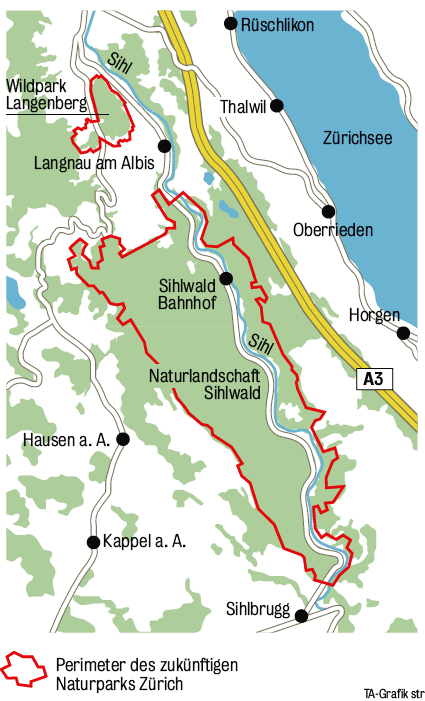

# Dead Tree Detection

This project is a hands-on notebook for detecting dead trees from high-resolution RGB aerial imagery.

Students will run a pretrained YOLO model, compare inference strategies, implement simple post-processing, analyse dead tree detections over time, test model generalization on a Ticino image, and try a small annotation-to-training workflow with LabelMe.

<p align="center">
  
</p>

## Notebook

Open:

```text
20260616_Dead_tree_detection.ipynb
```

The notebook contains:

- Sihlwald dead tree detection with a pretrained model
- Exercise 1: inference and post-processing hyperparameters
- Exercise 2: Sihlwald time series analysis
- Exercise 3: model generalization to Ticino, comparing `baseline.pt` and `best.pt`
- Exercise 4: hands-on annotation with LabelMe and a simple YOLO training template

## What You Need

- A GPU is recommended. Google Colab with a GPU runtime is the easiest option.
- Python packages listed in `requirements.txt`.
- Two model weight files:

```text
weights/best.pt
weights/baseline.pt
```

Download the weights from Google Drive:

```text
https://drive.google.com/file/d/1Cp0LFuUOyjW5N5ECib4xm3HM2spoEY05/view?usp=drive_link
```

Model weights are not uploaded to GitHub. After downloading, place both `.pt` files in the `weights/` folder.

## Option 1: Use Google Drive and Colab

This is the recommended setup for students.

1. Open the shared project folder:

   ```text
   https://drive.google.com/drive/folders/1iynveB87MwLTyCciUT4te3oixAqP1EZD?usp=sharing
   ```

2. Save the folder to your own Google Drive.

3. Open `20260616_Dead_tree_detection.ipynb` with Google Colab.

4. In Colab, enable GPU:

   `Runtime` -> `Change runtime type` -> `GPU`

5. In the first setup cell, use:

   ```python
   RUN_ENV = "colab"
   ```

6. Check that `PROJECT_DIR` points to your project folder in Google Drive.

7. Run the package installation cell in the notebook, then continue from top to bottom.

## Option 2: Run Locally

Clone the repository:

```bash
git clone https://github.com/yixin-zhou/20260619_SC_Dead_Tree_Detection.git
cd 20260619_SC_Dead_Tree_Detection
```

Install the required packages:

```bash
pip install -r requirements.txt
```

Download `best.pt` and `baseline.pt` from Google Drive and place them in:

```text
weights/best.pt
weights/baseline.pt
```

If you want to do Exercise 4 locally, also download the annotation images from the shared Google Drive folder and place them in:

```text
data/images_for_annotation/
```

Open the notebook:

```text
20260616_Dead_tree_detection.ipynb
```

In the first setup cell, use:

```python
RUN_ENV = "local"
```

## Annotation Exercise

Exercise 4 uses LabelMe. The images for annotation are stored in:

```text
data/images_for_annotation/
```

These annotation images are not uploaded to GitHub. If you are running the notebook locally, download them from the shared Google Drive folder first.

Each image is a 500 x 500 RGB PNG tile. LabelMe should save one `.json` file next to each `.png` image.

Use this label name exactly:

```text
dead_tree
```

Install and open LabelMe locally:

```bash
pip install labelme
labelme data/images_for_annotation
```

## Project Structure

```text
.
├── 20260616_Dead_tree_detection.ipynb
├── README.md
├── requirements.txt
├── data/
│   ├── Sihlwald_Research_Area/
│   ├── test_data_500m/
│   ├── test_data_200m/
│   └── images_for_annotation/
├── img/
├── weights/
│   ├── best.pt        # download separately
│   └── baseline.pt    # download separately
└── outputs/           # created by the notebook, not uploaded to GitHub
```
